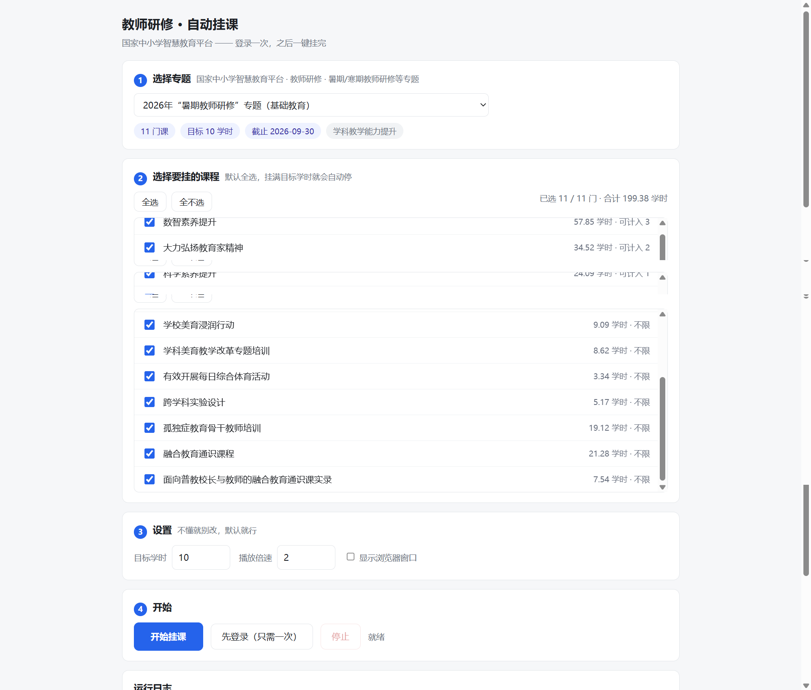

<!-- markdownlint-disable MD033 MD041 -->
<!--
  GitHub README 的居中页头必须用行内 HTML，且首行是 <div> 而非 # 标题。
  仅豁免这段页头，正文规则照旧生效。
  （注意：markdownlint 只认单行指令，把说明写进同一条注释会让指令失效）
-->
<div align="center">
  
  <h1>教师研修 · 自动挂课</h1>
  <p><b>登录一次，之后一键挂完 —— 不用守着窗口</b></p>


</div>
<!-- markdownlint-enable MD033 MD041 -->

---

面向 [`basic.smartedu.cn`](https://basic.smartedu.cn)（国家中小学智慧教育平台）**教师研修 / 教研**课程。

解决两件事：**切换窗口时视频自动暂停**，以及由此导致的**「学了但学时不上报」**。

> **⚠️ 先读风险**：本工具会绕过平台的学习行为校验，**可能违反其用户协议**，可能导致
> 学时不被认定、成绩作废、账号受限。请先确认这在你所在地区/单位是否被允许。
> 详见 [边界与风险](#边界与风险)，以及 [LICENSE](LICENSE)。

<p align="center">
  
</p>

---

## 快速开始

1. 装 **Node.js 20 或更新**（[下载](https://nodejs.org/)；装完**重开一次**命令行让 `node` 生效）
2. 双击 **`start.bat`** —— 它会自己检查环境、装依赖、开窗口
3. 窗口里四步：**选专题 → 勾课 → 设目标学时 → 点「先登录（只需一次）」再点「开始挂课」**

**不需要输入任何网址**（课程地址由程序按固定模板拼）。首次登录一次，之后一直有效。

> 开机挂着即可，**窗口可以最小化**：`start.bat` 的黑色控制台窗口要留着（关掉会停止挂课），
> 浏览器窗口则无所谓。再双击一次 `start.bat` 会接回同一个任务。

---

## 它是怎么做到的

### 平台在防什么（为什么不是「防暂停脚本」那么简单）

| 层 | 机制 | 现象 |
| --- | --- | --- |
| 1 | `document.visibilitychange` → `video.pause()` | 切窗口就暂停 |
| 2 | `window.blur` / `onblur` → 同上 | 同上 |
| 3 | Chrome 后台标签页节流（rAF 停止 / timer 限 1s / 5 分钟后 intensive throttle） | 不暂停但进度不涨 |
| 4 | 防挂机心跳 `setInterval(1000)` 校验 `currentTime` 是否推进 | **学时不上报** ← 真正的坑 |
| 5 | 隐藏倍速菜单（`.vjs-hidden`）+ 强制作答弹窗 | 抬高自动化门槛 |

引擎分四模块，缺一不可：

- **M1 反暂停** — 伪造 `document.hidden=false` → 拦截 `visibilitychange`/`blur` 注册 → 有条件劫持 `pause()` → 自动恢复播放
- **M2 防节流** — 持有 Web Lock（豁免 intensive throttling）+ 可选 keep-alive 音频
- **M3 自动播放** — 默认 2x、自动下一节、自动关确认弹窗
- **M4 学时核对** — 嗅探上报接口，实时比对**本地累计时长 vs 平台侧已学时长**

> 无头模式下第 1、2 层**天然不触发**（headless 里 `visibilityState` 恒为 `visible`），这是无头方案的结构性优势；M1 是给油猴方案准备的，以及防平台将来改用别的手段。

### ⚠️ 千万不要把视频静音

Chrome 对「正在播放音频」的标签页有后台节流豁免。脚本或扩展把视频 `muted=true` 后，**该豁免消失**，后台进度与学时上报都会失真 —— 很多现成挂课脚本的「学时不更新」就是这么来的。

正确做法：保留 `muted=false`，把**系统音量**或 **Chrome 标签页音量**调到 0。

### ✅ 无头到底能不能用？—— 已实测，**能**

关键卡点是 DRM。**根因**：Playwright 默认传 `--disable-component-update`，会阻止
Widevine CDM 组件下载，导致 `requestMediaKeySystemAccess('com.widevine.alpha')`
直接 `NotSupportedError`。**这跟「无头」没关系** —— 加不加这个参数，有头/无头表现完全一样：

| 启动方式 | Widevine |
| --- | --- |
| `channel:'chrome'`（默认带 `--disable-component-update`） | ❌ |
| `channel:'chrome'` + `ignoreDefaultArgs:['--disable-component-update']` | ✅ |
| 直接指定真 Chrome 路径（仍带该参数） | ❌ |
| 真 Chrome + 去掉该参数 | ✅ |

修复在 `src/browser.mjs`，已内置。代价：headless 首次启动会下载一次 CDM 组件（几十 MB）。

另外 `--headless` 下 Chrome 默认把 UA 写成 `HeadlessChrome/153.0.0.0`，这是很好认的指纹，已用检测到的真实版本号覆盖。

---

## 三种用法

### 方案 A：图形界面（推荐）

就是上面「快速开始」那三步。窗口里**不需要输入任何网址**，全部从下拉框与勾选框完成。

几点说明：

- **界面本身跑在 `127.0.0.1`**，只监听本机，不对外网开放。
- 界面窗口用的是**独立的 Chrome profile**（`%LOCALAPPDATA%\smartedu-autowatch-ui`），
  和挂课用的 profile 分开，不会互相抢。
- 命令行等价入口：`npm run ui`（开窗口）、`npm run serve`（只起服务）、`npm run list`（免登录列专题）。

### 方案 B：油猴脚本（浏览器扩展）

适合「边用电脑边挂着」，不需要装 Node。

1. Chrome 扩展商店装 **Tampermonkey（篡改猴）**
2. Tampermonkey 面板 → 添加新脚本 → 粘贴 `userscript/smartedu-autowatch.user.js` 全文 → 保存
   （或把 `.user.js` 直接拖进 Chrome 窗口）
3. 打开课程页，**先手动点一次播放**（取得用户手势）
4. 右上角出现状态面板即生效

| 快捷键 | 作用 |
| --- | --- |
| `Ctrl+Alt+P` | 在「禁止暂停」/「允许暂停」之间切换（想自己暂停时用） |
| `Ctrl+Alt+D` | 开关侦察模式 |
| `Ctrl+Alt+E` | 导出侦察结果（复制到剪贴板 + 写入 `window.__SMARTEDU_RECCE__`） |
| 双击面板 | 关闭面板 |

面板显示：播放状态、进度、**本地累计 vs 平台侧时长**、**拦截 pause 次数**、最近上报时间、真实后台状态。

### 方案 C：命令行（可无头，适合无人值守）

```bash
cd smartedu-autowatch
npm install                 # 装 playwright-core（约 1 个包，不下载浏览器）

# 1) 体检：确认无头可用
npm run probe

# 2) 登录一次（必须有头，独立 profile，只需一次）
npm run login

# 3) 挂课 —— 推荐按【专题】跑，自动凑够学时
#    2026 暑期教师研修（基础教育）= dc6d78f2-bad8-4d09-b8da-0d758803dbe4
npm run watch -- --train dc6d78f2-bad8-4d09-b8da-0d758803dbe4 --target-hours 10
npm run watch -- --train <trainId> --dry-run       # 先看会挂哪几门、各计多少学时

# 其他入口
npm run watch -- --url "https://basic.smartedu.cn/teacherTraining/courseDetail?courseId=<id>"
npm run watch -- --url "<URL>" --headful             # 退回有头
npm run watch -- --season 2025sqpx                   # 季节码（2025 及以前）
```

| 参数 | 说明 |
| --- | --- |
| `--train <trainId>` | ★ 按专题挂，自动凑够学时（推荐） |
| `--target-hours 10` | 目标学时，默认 10 |
| `--login` | 只开浏览器手动登录（强制有头） |
| `--url <URL或courseId>` | 挂单个课程（页内自动下一节） |
| `--season 2025sqpx` | 按季节码遍历（2025 及以前） |
| `--headless` / `--headful` | 默认**无头**；`--headful` 退回有头 |
| `--rate 2` | 倍速 |
| `--no-next` | 只挂当前这一节 |
| `--max-courses 3` | 试跑，只挂前 3 门 |
| `--min-section-sec 120` | 切课阈值，见下文「学时模型」；`0` = 关掉该规则 |
| `--per-course-min 0` | 单门课硬超时（分钟）；**0 = 按学时预算自适应** |
| `--dry-run` | 只列出会挂哪些课，不启动浏览器 |
| `--keep-throttled` | 不关后台节流（做对照实验用） |

运行时输出实时状态行，并写入 `out/report-*.json`，含每门课的：结果、本地累计秒数、
**平台侧秒数**、拦截 pause 次数、media error、注意事项。

**同一份 `userscript/*.user.js` 同时喂给油猴和 Playwright**，改一处两边都生效，不会出现「脚本修好了程序没好」。

---

## 学时模型（算得清、挂多久）

**1 学时 = 3600 秒视频**，即 `total_period = period / 3600`。
这条等式的验证：`124287/34.52 = 3600.0`、`208249/57.85 = 3599.8`，11 门课全部吻合。

| 量 | 含义 |
| --- | --- |
| `period` | 课程视频总秒数 |
| `total_period` | 课程总学时 |
| `max_period` | 本课**最多能计入专题的学时**；`-1` = 不限 |

**增速天花板 `period_hour_limit: 3.0` = 每真实小时最多认定 3 学时**
→ 平台结构上就允许到 3x。2x 只占额度 2/3，**安全**。（且公告明写「提供多种播放速度」）

`--train` 模式的预算逻辑（`src/run.mjs`）：

```text
本课预算 = min(本课 max_period, 离目标还差多少)
```

**学时挂够 ≠ 立刻切课。** 平台按**活动粒度**判定完成，切点落在活动中间的话这一节
可能白挂 —— 所以预算到点后只置一个「待切换」标志，真正的切点落在**活动边界**上：

| 退出条件 | outcome |
| --- | --- |
| 本节播完（引擎 `activity_ended_count` 自增） | `course_budget_met` / `target_met` |
| 整页资源全部完成 | 同上 |
| ★ 平台已学习学时到位（`certMet`） | `platform_met` —— **立刻切**，不等活动边界 |
| ★ 预算在本节开头 120s 内达成 | 同上（本节基本没挂，直接切） |
| 等活动边界超过 `overshootCap`（= 挂够那一刻的剩余时长 + 300s） | 同上（强行切，防卡死） |
| 引擎太旧、没 `activity_ended_count` | 立即切（优雅降级，不拖死跑批） |

⚠️ 注意上面那条 `overshootCap` —— 它以前写成 `max(1800, remainMedia + 300)` 每帧重算，
而 `remainMedia` 随播放递减，判据于是退化成「**走过剩余时长的一半**」：实测第 1 节
5811s、预算 3600s，会在**还剩 411s 时**切走，而平台只把整节看完的时长计入已学习学时
→ 这一整节彻底白挂。现在它是在预算达成那一刻**一次性算好的常量**。
（回归用例见 `tools/test-stop-logic.mjs` 的【3】）

> **为什么要加后两个「直接切」**：断点续播会让预算卡在最尴尬的位置。实测
> `科学素养提升` 第 1 节 8326s、平台续播点 4783s，本节最多只能再给 3543s，
> 而预算 3600s —— 于是预算在**切进第 2 节 57s 后**才达成，旧逻辑白等第 2 节
> 整节 10158s（≈2.8 小时），而平台早已 `已学习 3.08 ≥ 上限 1`、认定早就到位。
> 现在这种情况立即切。
>
> 那个 120s 阈值可用 **`--min-section-sec`** 调（默认 120，`0` = 关掉该规则、退回
> 一律等本节播完）：
>
> ```bash
> node src/run.mjs --train <trainId> --min-section-sec 300   # 保守一点
> node src/run.mjs --train <trainId> --min-section-sec 0     # 完全退回旧行为
> ```
>
> 生效值会打进日志和报告（`options.minSectionSec`），事后能查这次到底用的多少。

代价是最多多挂一节（`数智素养提升` 平均 583s/节 ≈ 0.16 学时），换来切点落在活动边界。
已实测：预算 0.05 学时时，一直播到本节自然结束（`16:45→19:11`）才切，
多挂 0.04 学时并计入总账。

所以 **10 学时实测路径 ≈ 5 门课 × 2x ≈ 5 小时**，而不是把 199.38 学时全挂完。
`max_period = -1` 的课必须用「剩余缺口」封顶，否则会把整门 10 小时全挂完。

> **别拿平台 `progress` 当实时探针**：它是「已完成活动数」且按 600s/3600s 窗口
> 批量刷新。跨一个窗口（1800s）没动静才值得怀疑。

### 登录态放在哪

独立 profile：`%LOCALAPPDATA%\smartedu-auto-profile`（已加进 `.gitignore`）。

**不复用日常 Chrome 的 profile**，原因有二：日常 Chrome 运行时目录被锁；且 Chrome ≥136 禁止在默认 profile 上开调试端口。

`--login` 只需跑一次。登录态判定见 `src/browser.mjs` 的 `loginState()` —— 注意这里有个坑：`_X_STAT_EVENT_SESSION` / `sajssdk_*` 这类**埋点键**含有 `session`/`user` 字样，用宽泛正则会误报成「已登录」，所以判定逻辑是**先排黑名单，再要求强信号**（`token`/`ticket`/`jwt`，或值形如 JWT）。

---

## 目录

```text
smartedu-autowatch/
├── start.bat                           ★ 双击这个就能用（检查环境 → 装依赖 → 开界面）
├── package.json
├── assets/                             logo（SVG 源 + PNG）与界面截图
├── userscript/
│   └── smartedu-autowatch.user.js      ★ 引擎本体（两套方案共用）
├── src/
│   ├── engine.mjs                      宿主注入层（读上面那个文件，一字不改）
│   ├── browser.mjs                     Chrome 启动 / 反节流参数 / Widevine 修复 / 登录态判定 / 单实例锁
│   ├── preflight.mjs                   启动前体检（Node 版本、Chrome、profile 占用）+ 友好报错
│   ├── redact.mjs                      日志脱敏（token / user_id 不得进日志与界面截图）
│   ├── courses.mjs                     平台接口层（课程列表 / 专题元数据 / 学时读数）
│   ├── sites/                          ★ 挂课类型（可插拔，新增类型 = 加一个文件）
│   │   ├── index.mjs                   注册表：getSite(id)
│   │   └── teacher-training.mjs        教师研修适配器
│   ├── web/                            ★ 图形界面
│   │   ├── server.mjs                  零依赖 HTTP 服务（127.0.0.1）
│   │   ├── ui.html                     单文件界面（内联 CSS/JS，无构建）
│   │   ├── launch.mjs                  起服务 + chrome --app 桌面窗口
│   │   └── serve-only.mjs              只起服务（调试 / 自备浏览器）
│   ├── probe.mjs                       体检：Widevine / 解码 / 指纹 / 登录态
│   └── run.mjs                         挂课主程序（编排 + 报告）
├── tools/
│   ├── selftest.mjs                    无头自检，15 项断言（改完引擎跑这个；需独占 profile）
│   ├── test-stop-logic.mjs             切课时机 + 停滞自愈 + 日志脱敏回归，52 项断言（改完 run.mjs 跑这个）
│   ├── test-web.mjs                    界面后端回归，63 项断言（改完 src/web/ 跑这个；不用 Chrome）
│   ├── check-handoff.mjs               发包前凭据自检（发人之前跑这个；报告会公开豁免行数）
│   ├── render-logo.mjs                 由 assets/logo.svg 生成 PNG 资源
│   ├── watch.mjs                       实时监控跑批日志（自动选 out/ 下最新日志；进度行是 \r 原地刷新的）
│   ├── verify-rate.mjs                 验倍速是否真的生效
│   ├── diag-*.mjs                      各类一次性诊断（学时 / 解码 / 网络 / Widevine …）
│   └── launch-chrome-automation.cmd    带调试端口的独立 Chrome（手工 CDP 调试用）
└── docs/
    ├── recce.md                        侦察记录
    └── handoff.md                      ★ 交接说明 + 试用验收清单（发人之前读这个）
```

---

## 改完代码必须跑的回归

```bash
npm test                                  # = test:stop + test:web
node tools/test-stop-logic.mjs            # 52 项：切课时机状态机 + 停滞自愈 + 日志脱敏（纯函数，秒出）
node tools/test-web.mjs                   # 63 项：界面后端 buildRunArgs / HTTP / 退出码文案（不用 Chrome）
node tools/selftest.mjs                   # 15 项：引擎注入 / 伪造可见性 / 拦截 pause …（需独占 profile）
node tools/check-handoff.mjs              # 发包前自检：凭据 / 不该随包发出的目录 / .bat 行尾
```

`tools/test-stop-logic.mjs` 直接拿**真实日志数据**回放 `decideStop()`：
科学素养提升（第 1 节 8326s、续播点 4783s、预算 3600s、上限 1）、
心理健康教育能力提升（第 1 节 5811s、预算 3600s）。它已经抓到过一次既有 bug ——
`overshootCap` 每帧用递减的 `remainMedia` 重算，判据退化成「走过剩余时长的一半」，
会在本节**还剩 411s 时切走**，而平台只把整节看完的时长计入已学习学时 → 整节白挂。
现在 `overshootCap` 在预算达成那一刻**一次性算好**（剩余时长 + 300s 余量）。

---

## 先侦察，再修（平台改版时的救生索）

脚本没效果时**不要猜**：

1. 打开课程页，`Ctrl+Alt+D` 开侦察模式
2. 正常播放，切走窗口复现一次暂停
3. `Ctrl+Alt+E` 导出，拿到 JSON：
   - `pauseStacks` — **谁调了 pause**（含调用栈）；若为空，说明根本不是 `pause()` 触发，而是 `src`/autoplay 层面被改
   - `reportLog` — 学时上报接口的 URL / 频率 / 请求体 / 响应
   - `dom` — `video` 的父级链、候选选择器命中数、`fish-*` 类名普查、课程条目及完成标记
   - `state.pauseBlockedWhileHidden` — 被拦下的暂停是否真在后台发生

选择器集中在 `SEL` 常量里，与主逻辑分离。平台改版后把导出的 `fish-*` 类名填进去即可。

---

## 引擎配置

`userscript/smartedu-autowatch.user.js` 顶部 `CONFIG`：

| 键 | 默认 | 说明 |
| --- | --- | --- |
| `playbackRate` | `2` | 倍速 |
| `autoNext` | `true` | 看完自动下一节 |
| `autoDismissModal` | `true` | 自动点「我知道了/确定」 |
| `autoAnswerQuestion` | **`false`** | 自动答题。默认关闭：答题多为计分项，脚本不该替你决定答案 |
| `keepAliveAudio` | `false` | 用 20kHz 振荡器让 Chrome 认为是音频标签页。后台仍被节流时打开 |
| `blockFocusEvents` | `true` | 拦截 `visibilitychange`/`blur` 注册。页面其他交互异常时关掉 |
| `fakeVisibility` | `true` | 伪造 `document.hidden`/`visibilityState` |
| `holdWebLock` | `true` | 持 Web Lock 豁免 intensive throttling |
| `noUI` | `false` | 由宿主（Playwright）置 `true`，不渲染浮层面板 |

宿主覆盖方式：注入前设置 `window.__SMARTEDU_CONFIG__`，引擎在 `document-start` 读取并只覆盖已存在的键。

---

## 边界与风险

- 这属于绕过平台的学习行为校验，**可能违反其用户协议**；教师研修类项目存在抽查
- 单账号使用，不要批量多开
- 答题环节默认交还给人；不要用伪造数据的方式刷学时
- 建议保留 `out/report-*.json`，万一被问询至少有真实观看时长记录

### 关于隐私

- **`out/` 目录绝不要发出去。** 里面（如 `out/*-recon.json`、`out/run-*.log`）会原样
  记录平台返回的**个人 userId 与登录 token**。已加进 `.gitignore`，但打包时别用
  「整个文件夹压缩」的方式绕过它。
- **日志里的凭据已自动脱敏**（`src/redact.mjs`）：终端、界面日志面板、`out/*.log`
  里出现的一律是 `UC_TOKEN-****-ncet-xedu` 与 `123****789`。所以**截图发反馈是安全的**
  —— 但包里的旧日志不在此列，仍然别发（见上一条）。
- **登录态不能随包发。** 独立 profile 目录里有 cookie，拿到的等价于你的账号。
- **本工具不做任何服务端通信。** 所有请求都直接打到官方平台，没有中转、没有上报。

### 交付给他人使用前

跑一遍自检脚本，它会扫凭据、检查不该随包发出的目录、以及 `.bat` 的行尾：

```bash
node tools/check-handoff.mjs
```

打包用**白名单复制**，不要「右键 → 压缩整个文件夹」：

```text
start.bat  package.json  LICENSE  README.md  assets  src  userscript  tools  docs
```

`out/`、`node_modules/`、`.chrome-profile/`、`*.lock`、`*.log` 绝不随包发出。

---

## 状态

- [x] Phase 0 侦察（离线 + 登录态基础设施）— 见 `docs/recce.md`
- [x] Phase 1 引擎 v1（油猴 + Playwright 共用）— 无头自检 15/15 通过
- [x] Phase 2 学时核对（本地 vs 平台侧，卡住即告警）
- [x] Phase 3 Playwright 编排（整季/专题遍历 + 报告 + 进程级关节流 + 无头）
- [x] 无头可行性结论 — **可用**，根因与验证见上
- [x] 真实课程页实测回填 —— **已全部验完**，见 `docs/recce.md` §6
      （无 DRM、HLS+TS 分片、`paused_blocked: 0`、零弹窗零答题、真实 DOM）
- [x] 学时模型定论 —— 1 学时 = 3600s；2x 合规；10 学时 ≈ 5 小时，见 `docs/recce.md` §5
- [x] 2026 专题入口 —— `--train dc6d78f2-…`，11 门课 199.38 学时
- [x] `--train` 自动凑学时 + 按预算收工
- [x] 切课点对齐**活动边界**：挂够学时先等本节播完再切（引擎 `activity_ended_count`，已端到端实测）
- [x] 整轮 10 学时长跑 —— **已完成**：`平台已认定 10.32 学时`
- [x] Phase 4 选择器配置外置成 JSON、结构化日志
- [x] Phase 5 图形界面（方案 A）—— `start.bat` → `chrome --app` 窗口；
      视觉与交互已实测（选专题 → 勾课 → 开始）；界面后端回归 63/63
- [x] 挂课类型适配器化 —— `src/sites/`，新增类型 = 加一个文件（只答 4 个问题：
      有哪些专题 / 专题里有哪些课 / 课程 URL 怎么拼 / 进度和学时怎么读）
- [x] 单实例守卫 —— profile 是单例资源，双击两次不再 `exitCode=21` 崩溃，改为人话提示
- [x] 停滞自愈 —— 页面卡住 ≥180s 自动 reload（最多 3 次），配额用尽就真的换下一门；
      判断逻辑已抽为纯函数 `stallRecovered()` 并单测
      —— 修掉了「reload 后配额被立即清零 → 无限 reload」与「说放弃却不退出」两个真缺陷
- [x] 交付件清理 —— 移除硬编码 userId / 文档里的 token；补 `.gitignore` 与 `start.bat`；
      日志出口统一脱敏（含裸 `console.log` 这条绕过路径）
- [ ] 单文件 exe（Node SEA）—— 目标：对方连 Node.js 都不用装
      **决定：先不做。** 先用 `start.bat` 让真人跑一轮，确认「登录 → 勾课 → 挂完」
      这条链路对小白真的无阻，再决定要不要投入打包（playwright-core 在 SEA 下
      能否定位浏览器有不确定性）。试用验收清单见 `docs/handoff.md`。

---

## 许可

**保留所有权利（All Rights Reserved）** —— 本仓库公开可见，但「可见」不等于「授权」：
仅限阅读与评估，未经书面许可不得使用、复制、修改或再分发。

完整条款与免责声明见 [LICENSE](LICENSE)。本软件与国家中小学智慧教育平台及其运营方
无任何隶属或背书关系，亦非其官方产品。
